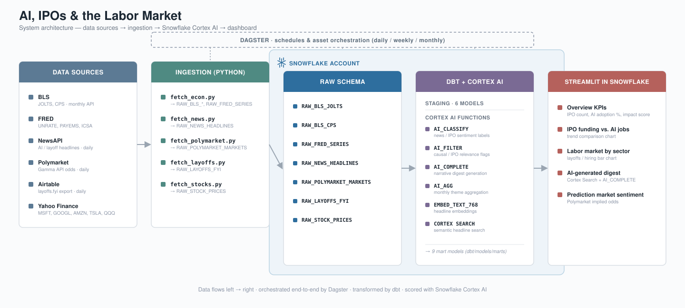

# snowflake-cortex-labor-market

**Do the numbers back up the fear?**



An end-to-end data pipeline and analytics platform that uses Snowflake Cortex AI to investigate whether public anxiety about AI-driven job displacement is supported by actual economic data. BLS and FRED figures are joined with tech layoffs, stock market proxies, news sentiment, and Polymarket prediction-market odds, then analyzed using Cortex AI functions to surface correlations, classify sentiment, and generate narrative digests — orchestrated by **Dagster**, transformed by **dbt**, and surfaced in a **Streamlit in Snowflake** dashboard.

---

## What it does

- Ingests labor data from the **BLS** (JOLTS layoffs by industry, CPS unemployment) and **FRED** (nonfarm payrolls, initial claims) — monthly, since that's the source cadence
- Scrapes tech industry layoffs directly from **Layoffs.fyi** (via Airtable shared view parsing) — daily
- Fetches daily stock closing prices for AI/tech proxies (**MSFT**, **GOOGL**, **AMZN**, **TSLA**, and **QQQ**) from **Yahoo Finance** — daily
- Pulls news headlines matching AI, job-loss, and tech IPO targets (**OpenAI**, **Anthropic**, **SpaceX**) from **NewsAPI** — daily
- Pulls implied probabilities from **Polymarket** for recession, unemployment, AI-jobs, and IPO-related prediction markets — a market-priced fear signal, distinct from news sentiment — daily
- Runs the corpus through **Snowflake Cortex AI** functions to classify, filter, embed, aggregate, and narrate
- Exposes findings in a **Streamlit in Snowflake** dashboard with five analytical views

---

## Orchestration & transformation

| Layer | Tool | Role |
|---|---|---|
| Orchestration | **Dagster** | Schedules ingestion + transforms at the cadence each source actually supports |
| Transformation | **dbt** | All `RAW` → `CORTEX` schema modeling, including incremental Cortex AI models |
| AI compute | **Snowflake Cortex** | Classification, embedding, aggregation, narrative generation |

**Why three cadences, not one.** BLS and FRED publish monthly — there's no way to make labor market surveys update faster. But stocks, layoffs, and news change daily, and Polymarket prices update continuously. Forcing everything onto a monthly refresh buries fresher signals behind the slowest one.

| Schedule | Cron | What runs |
|---|---|---|
| **Daily** (6 AM UTC) | `0 6 * * *` | Ingest stocks, layoffs, news, Polymarket → `dbt run --select tag:daily` (incremental Cortex classification on new rows only) → refresh Cortex Search service |
| **Weekly** (Thursday 8 AM UTC) | `0 8 * * 4` | FRED `ICSA` initial claims refresh — matches the BLS weekly release schedule |
| **Monthly** (2nd, 9 AM UTC) | `0 9 2 * *` | Full BLS + FRED ingestion → `dbt run --select tag:monthly` (`AI_AGG` theme rollups, `AI_COMPLETE` digest regeneration) |

dbt's incremental materialization on `news_classified`, `news_embeddings`, and `news_ipo_classified` means Cortex AI functions only run against headlines that haven't been classified yet — daily re-runs don't re-pay for already-processed rows.

---

## Cortex AI features

| Function | Application |
|---|---|
| `AI_CLASSIFY` | Labels each headline (e.g. `layoff`, `hiring`, `ai_fear`, `ipo_optimism`, `valuation_hype`) |
| `AI_FILTER` | Boolean flags — does the article cite AI for job loss, or discuss IPO/private valuations? |
| `AI_EMBED` | Vectorizes headlines using Arctic Embed for semantic similarity |
| `AI_AGG` | Rolls up monthly headline themes with no context-window limit |
| `AI_COMPLETE` | Generates a monthly economic digest and IPO market narrative from structured + unstructured data |
| Cortex Search | Powers natural-language headline search in the dashboard |

---

## Architecture

```
[BLS API]  [FRED API]  [NewsAPI]  [Layoffs.fyi]  [Yahoo Finance]  [Polymarket]
     │           │           │           │              │               │
     ▼           ▼           ▼           ▼              ▼               ▼
              Dagster assets (dagster_project/assets/ingestion.py)
     fetch_econ.py  fetch_news.py  fetch_layoffs.py  fetch_stocks.py  fetch_polymarket.py
                                     │
                        LABOR_MARKET.RAW (Snowflake)
                        ├── RAW_BLS_JOLTS / RAW_BLS_CPS
                        ├── RAW_FRED_SERIES
                        ├── RAW_NEWS_HEADLINES
                        ├── RAW_LAYOFFS_FYI
                        ├── RAW_STOCK_PRICES
                        └── RAW_POLYMARKET_MARKETS
                                     │
                        dbt (dbt/models/) — orchestrated by Dagster's @dbt_assets
                        ├── staging/   (clean + type RAW tables)
                        └── marts/     (Cortex AI transforms, incremental where AI cost applies)
                                     │
                        LABOR_MARKET.CORTEX
                        ├── NEWS_CLASSIFIED                      (AI_CLASSIFY + AI_FILTER, incremental)
                        ├── NEWS_EMBEDDINGS                      (AI_EMBED, incremental)
                        ├── NEWS_IPO_CLASSIFIED                  (AI_CLASSIFY + AI_FILTER, incremental)
                        ├── LAYOFFS_FYI_CLEAN
                        ├── STOCK_MONTHLY_PERFORMANCE
                        ├── MONTHLY_PREDICTION_MARKET_SENTIMENT  (Polymarket odds by category)
                        ├── MONTHLY_SENTIMENT_THEMES             (AI_AGG)
                        ├── MONTHLY_IPO_SENTIMENT                (AI_AGG)
                        ├── MONTHLY_DIGEST                       (AI_COMPLETE)
                        ├── MONTHLY_INTEGRATED_DIGEST            (AI_COMPLETE)
                        └── HEADLINE_SEARCH                      (Cortex Search service, Dagster asset)
                                     │
                        Streamlit in Snowflake
                        ├── Fear vs. Reality   (BLS vs. Layoffs.fyi + correlations + Polymarket recession odds)
                        ├── Monthly Digests    (macro vs. tech-integrated narrative)
                        ├── Semantic Search    (Cortex Search)
                        ├── Sector Breakdown   (JOLTS sectors + tech stages)
                        └── IPO & Tech Stocks  (Tech stock prices + IPO news + prediction market trends)
```

---

## Data sources

| Source | Series / Target | Cadence | Description |
|---|---|---|---|
| BLS JOLTS | `JTS*LAY` | Monthly | Layoffs and discharges by industry |
| BLS CPS | `LNS14000000`, `LNS11300000` | Monthly | Unemployment rate, labor force participation |
| FRED | `UNRATE`, `PAYEMS` | Monthly | Unemployment, nonfarm payrolls |
| FRED | `ICSA` | Weekly | Initial jobless claims |
| NewsAPI | Various | Daily | Headlines matching AI + labor market + IPO targets |
| Layoffs.fyi | Airtable view | Daily | Specific tech company layoff dates and employee counts |
| Yahoo Finance | MSFT, GOOGL, AMZN, TSLA, QQQ | Daily | Tech proxies and index daily close prices |
| Polymarket | Recession, unemployment, AI-jobs, IPO markets | Daily | Implied probability — what people are betting on, not just saying |

No API key is required for Yahoo Finance, Layoffs.fyi, or Polymarket's Gamma API — all are public, unauthenticated endpoints.

---

## Setup

**Sign up for a Snowflake trial first, if you don't already have an account.** As of writing, [Snowflake's trial signup](https://www.snowflake.com/en/snowflake-trial/) offers two options — to get Cortex AI access (which this whole project depends on), you must pick the **"Cortex Cloud CLI"** trial, not the plain one. It reserves $40 of Cortex inference credit out of the $400 total trial credit; the plain trial doesn't include Cortex access at all.

### 1. Snowflake environment

Add the `sql/` folder to a Snowflake **Workspace** (Projects → Workspaces) and run these two files in order — this is schema/table DDL only, no data yet:

```sql
sql/00_setup.sql      -- database, schemas, warehouse, stages
sql/01_raw_tables.sql -- raw layer DDL (all 7 RAW tables, including Polymarket)
```

`sql/02_cortex_transforms.sql` and `sql/03_ipo_market_transforms.sql` are also in that folder — see step 3 below for when (and when *not*) to run them.

### 2. Configure environment

```bash
uv sync

cp .env.example .env
# then fill in SNOWFLAKE_ACCOUNT, SNOWFLAKE_USER, SNOWFLAKE_TOKEN (programmatic access
# token, not your login password), and the BLS/FRED/NewsAPI keys
```

`uv run` reads env vars from the file named by `UV_ENV_FILE` (defaults to none — you must set it). Two ways to wire that up:

- **direnv (recommended)** — auto-exports `UV_ENV_FILE` whenever you `cd` into the repo:
  ```bash
  curl -sfL https://direnv.net/install.sh | bash   # or your package manager
  echo 'eval "$(direnv hook bash)"' >> ~/.bashrc && source ~/.bashrc   # or the zsh/fish equivalent
  echo 'export UV_ENV_FILE=.env' > .envrc
  direnv allow .
  ```
- **Manual export** — set it yourself each session:
  ```bash
  export UV_ENV_FILE=.env
  ```

All commands below run through `uv run` so they use the project's pinned virtualenv (`.venv`) rather than any globally installed dbt/Dagster.

### 3. Cortex AI smoke test (optional, one-time)

`sql/02_cortex_transforms.sql` and `sql/03_ipo_market_transforms.sql` are a standalone, pre-dbt reference implementation of the same `AI_CLASSIFY`/`AI_FILTER`/`AI_EMBED`/`AI_AGG` transforms dbt owns from step 4 onward. They're useful as a quick end-to-end check that Cortex actually works on your account/trial, without setting up dbt or Dagster first:

```bash
# seed RAW with a first batch of real data
uv run ingestion/fetch_econ.py
uv run ingestion/fetch_layoffs.py
uv run ingestion/fetch_stocks.py
uv run ingestion/fetch_news.py
uv run ingestion/fetch_polymarket.py
```

Then run `sql/02_cortex_transforms.sql` and `sql/03_ipo_market_transforms.sql` in the Workspace (each needs the RAW tables above already populated — that's why they run after ingestion, not with `00`/`01`).

**Run this at most once, and never again after step 4.** Both scripts `CREATE OR REPLACE` tables — `NEWS_CLASSIFIED`, `LAYOFFS_FYI_CLEAN`, `MONTHLY_SENTIMENT_THEMES`, and six more — under the exact same names (Snowflake identifiers are case-insensitive) as the dbt models in `dbt/models/marts/`. Once dbt has run, it owns these tables incrementally, only reclassifying headlines it hasn't seen before; re-running the raw SQL scripts afterward silently wipes that incremental state and burns Cortex credits reclassifying the entire corpus from scratch on the next `dbt run`.

### 4a. Run via Dagster (recommended)

```bash
uv run dbt parse --project-dir dbt --profiles-dir dbt   # generates dbt/target/manifest.json
uv run dagster dev -m dagster_project.definitions
```

Open the Dagster UI, materialize assets manually for a first backfill, then let the three schedules (`daily_ingestion_and_transform`, `weekly_icsa_refresh`, `monthly_econ_and_digest`) take over.

### 4b. Run manually (no orchestrator)

```bash
uv run ingestion/fetch_econ.py
uv run ingestion/fetch_layoffs.py
uv run ingestion/fetch_stocks.py
uv run ingestion/fetch_news.py
uv run ingestion/fetch_polymarket.py

uv run dbt run --project-dir dbt --profiles-dir dbt
```

### 5. Deploy the dashboard

In Snowflake → **Streamlit** → **+ Streamlit App**:
- Switch your active role to `SYSADMIN` *before* creating the app — a Streamlit-in-Snowflake app runs as whichever role owns it, and `ACCOUNTADMIN` doesn't automatically inherit `SYSADMIN`'s privileges on `LABOR_MARKET.CORTEX` objects (they're peers, not parent/child). Creating it under the wrong role hits the same "no privileges on it" error as the `HEADLINE_SEARCH` issue above.
- Paste contents of `streamlit/app.py`
- Set database: `LABOR_MARKET`, warehouse: `LABOR_WH`
- In the app's **Packages** dropdown, add `snowflake.core` — the Semantic Search tab queries `HEADLINE_SEARCH` via the Cortex Search Python API (`snowflake.core.Root`), since Cortex Search services aren't queryable from plain SQL outside of `SEARCH_PREVIEW` (testing-only, not for app use)

---

## Troubleshooting

**"Object ... already exists, but current role has no privileges on it" (RAW tables, `LABOR_WH`, etc.)**
Every `sql/*.sql` script now opens with `USE ROLE SYSADMIN;`, so objects created by these scripts always land under SYSADMIN. But if an object was already created under a different role before you ran these scripts — e.g. you clicked through Snowsight's warehouse-creation wizard, or ran `01_raw_tables.sql`/`02_cortex_transforms.sql`/`03_ipo_market_transforms.sql` in a worksheet session that wasn't actually on SYSADMIN — `CREATE ... IF NOT EXISTS` is a no-op and silently leaves ownership on the original role. dbt/Dagster (which always connect as SYSADMIN) then can't see or write to it. Fix once, as `ACCOUNTADMIN`, for whichever objects are affected:
```sql
USE ROLE ACCOUNTADMIN;
GRANT OWNERSHIP ON ALL TABLES IN SCHEMA LABOR_MARKET.RAW TO ROLE SYSADMIN COPY CURRENT GRANTS;
GRANT OWNERSHIP ON FUTURE TABLES IN SCHEMA LABOR_MARKET.RAW TO ROLE SYSADMIN COPY CURRENT GRANTS;
GRANT OWNERSHIP ON ALL TABLES IN SCHEMA LABOR_MARKET.CORTEX TO ROLE SYSADMIN COPY CURRENT GRANTS;
GRANT OWNERSHIP ON FUTURE TABLES IN SCHEMA LABOR_MARKET.CORTEX TO ROLE SYSADMIN COPY CURRENT GRANTS;
GRANT OWNERSHIP ON WAREHOUSE LABOR_WH TO ROLE SYSADMIN COPY CURRENT GRANTS;
```
The same applies to the Cortex Search service (`cortex_search_service` in `dagster_project/assets/dbt_assets.py` runs `CREATE OR REPLACE CORTEX SEARCH SERVICE` directly, outside dbt) — if it was ever created under a different role, `COPY CURRENT GRANTS` ownership transfer isn't guaranteed to carry over cleanly for search services, so the simplest fix is to drop it and let the next run recreate it fresh under SYSADMIN:
```sql
USE ROLE ACCOUNTADMIN;
DROP CORTEX SEARCH SERVICE IF EXISTS LABOR_MARKET.CORTEX.HEADLINE_SEARCH;
```

**dbt objects end up in a `CORTEX_CORTEX` schema instead of `CORTEX`**
`dbt/profiles.yml` sets the target `schema: CORTEX`. If `dbt/dbt_project.yml` *also* sets `+schema: CORTEX` per model, dbt's default `generate_schema_name` macro concatenates default + custom schema names into `CORTEX_CORTEX`. `dbt_project.yml` no longer sets a per-model `+schema` for this reason — the target schema from `profiles.yml` is sufficient. If you see a `CORTEX_CORTEX` schema in Snowflake, it's dead weight from before this fix and safe to drop.

**dbt/Dagster connection needs a temporary MFA bypass (`ALTER USER ... SET MINS_TO_BYPASS_MFA`)**
Programmatic access tokens are designed to bypass MFA entirely — there's no documented link between MFA and PAT authentication. If dagster/dbt connections only work right after an MFA bypass, MFA likely isn't the actual gate. More likely: your Snowflake user has no **network policy** attached — human (`TYPE=PERSON`) users can *generate* a PAT without one, but need one attached to *authenticate* with it. As `ACCOUNTADMIN`, check:
```sql
SHOW NETWORK POLICIES;
DESC USER <your_user>;             -- look for NETWORK_POLICY
SHOW AUTHENTICATION POLICIES;      -- if one exists, confirm PROGRAMMATIC_ACCESS_TOKEN is in AUTHENTICATION_METHODS
```
Attaching a network policy (even a permissive one, for personal/trial use) is a one-time fix instead of a recurring bypass.

---

## Design notes

**Why use tech proxies for private companies?**
OpenAI, Anthropic, and SpaceX are private. We use key public investor stocks (MSFT for OpenAI, GOOGL/AMZN for Anthropic) and related tech stock indicators (TSLA, QQQ) to serve as public market comparables and baseline indicators of valuation sentiment.

**Why scrape the Airtable view for Layoffs.fyi?**
Layoffs.fyi is managed in an Airtable base. Since there is no public API key provided, we dynamically query their embed page, extract the dynamic view identifier (`viw*`), and fetch the raw CSV directly to ensure data fidelity.

**Why Polymarket?**
News sentiment captures what people *say*; prediction markets capture what people are willing to *bet money on*. Adding implied probabilities for recession, unemployment, and AI-jobs questions gives the "fear vs. reality" thesis a market-priced data point alongside stock returns and headline classification.

**Why dbt incremental models for Cortex AI tables?**
`AI_CLASSIFY`, `AI_FILTER`, and `AI_EMBED` cost Cortex credits per row. Daily re-runs would re-classify the entire headline history every time without incremental materialization — `is_incremental()` filters to only unclassified `article_id`s.

**Why is the Cortex Search service creation a Dagster asset instead of a dbt model?**
`CREATE OR REPLACE CORTEX SEARCH SERVICE` is DDL, not a `SELECT` statement, so it can't be a dbt model. It runs as a plain Python asset (`dagster_project/assets/dbt_assets.py::cortex_search_service`) that depends on `news_embeddings` completing first.

---

## Stack

Snowflake · Cortex AI · Dagster · dbt · Streamlit in Snowflake · Python · BLS API · FRED API · NewsAPI · Yahoo Finance · Layoffs.fyi · Polymarket
